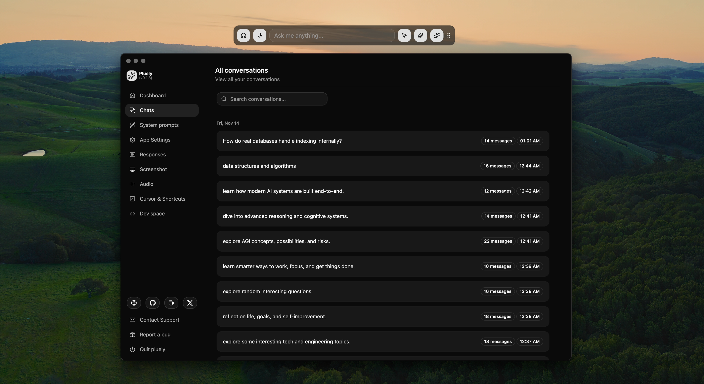

# ⚡ Interview Bot — Real-Time AI Interview & Meeting Co-Pilot 🥷

<div align="center">



<br/><br/>

[](https://github.com/devang-altf4/interviewbot)
[-orange?style=for-the-badge&logo=rust)](https://tauri.app/)
[](https://reactjs.org/)
[](https://tailwindcss.com/)
[](LICENSE)

**The ultimate zero-latency, privacy-first, undetectable AI assistant engineered for live technical interviews, coding assessments, system design rounds, and high-stakes meetings.**

[Features](#-key-features--flex-capabilities) • [Architecture](#-architecture--tech-stack) • [Keyboard Shortcuts](#-keyboard-shortcuts) • [Quick Start](#-quick-start) • [Supported Models](#-supported-ai-providers--models) • [Privacy & Security](#-privacy--security)

</div>

---

## 🚀 The Flex Advantage

> **Why choose Interview Bot over bulky alternatives?**
>
> Traditional meeting bots and AI wrappers are heavy, laggy, and send your screen/audio data to unknown middleman servers. **Interview Bot** is built natively in **Rust + Tauri v2**, weighing in at just **~10MB**, launching in **<100ms**, consuming **90% less RAM than Electron**, and keeping **100% of your data local and encrypted**.

| Feature | ⚡ Interview Bot (Rust + Tauri) | 🐌 Legacy Electron Apps |
| :--- | :--- | :--- |
| **App Footprint** | **~10MB** (Ultra-compact native binary) | **~250MB - 500MB+** |
| **Startup Latency** | **<100ms** (Instant zero-wait launch) | 3 - 8 seconds |
| **RAM / CPU Overhead** | **<60MB RAM** (Lightweight Rust runtime) | 400MB - 1GB+ RAM |
| **Invisibility Protection** | **Native Window Content Protection** | Easily captured in screen shares |
| **Audio Pipeline** | **Direct Loopback + Silero VAD** | Heavy background workers |
| **Privacy Model** | **Direct Client-to-Provider API** | Proxied through third-party servers |
| **Cost** | **100% Free & Open-Source** | $20 - $50 / month subscriptions |

---

## ✨ Key Features & Flex Capabilities

### 🥷 1. Invisible Stealth HUD Overlay
- **Screen Share Protection**: Utilizes native OS window content protection (`contentProtected: true`). The overlay is completely invisible to screen recording and conferencing software (Zoom, Google Meet, Microsoft Teams, Slack Huddles, Discord).
- **Translucent Floating Window**: Stays pinned above all active IDEs, coding terminals, and browsers without stealing window focus or interrupting your typing.
- **Panic Hide & Instant Toggle**: Single keystroke hides the overlay instantaneously with zero trace on the desktop.

### 🎙️ 2. Real-Time System Audio & Voice Transcription
- **Dual-Channel Audio Loopback**: Captures the interviewer's voice directly from system sound output in real-time.
- **Voice Activity Detection (VAD)**: Powered by Silero VAD to automatically detect speech pauses, filter out background noise, and eliminate hallucinated transcriptions.
- **Multi-Engine STT**: Pluggable Speech-to-Text support with **OpenAI Whisper**, **Groq Whisper (ultra-fast <300ms transcription)**, **ElevenLabs**, and custom self-hosted endpoints.

### ⚡ 3. Flex-Answer Engine (Instant Responses & Code Solutions)
- **Streaming Answer Generation**: Answers stream token-by-token with sub-second response times.
- **Cheat-Sheet Bullet Summaries**: Synthesizes complex algorithmic explanations into scannable talking points so you can speak naturally without sounding like you're reading a script.
- **Live Code Highlighting**: Syntax-highlighted code snippets powered by **Shiki** across 50+ programming languages (Python, Go, Rust, Java, C++, TypeScript, etc.).
- **LaTeX & Mathematical Formula Rendering**: Real-time equation rendering via **KaTeX** for data science, machine learning, and quantitative finance rounds.

### 📸 4. Instant Screen & Region OCR Capture
- **One-Tap Vision Capture**: Snap a screenshot or select a custom bounding box over any LeetCode problem, diagram, whiteboard, or system architecture chart.
- **Multimodal Vision Analysis**: Automatically passes captured visual contexts to multimodal LLMs (GPT-4o, Claude 3.7 Sonnet, Gemini 2.0 Flash) for instant problem breakdown, edge-case analysis, and optimal time/space complexity solutions.

### 🧠 5. Multi-LLM Orchestration
- Switch dynamically between industry-leading LLMs depending on the interview round:
  - 🟢 **Anthropic Claude 3.7 Sonnet / Claude 3.5 Sonnet** (Top-tier reasoning & code generation)
  - 🟢 **OpenAI GPT-4o / o1 / o3-mini** (Deep logic & problem solving)
  - 🟢 **Google Gemini 2.0 Flash** (Ultra-fast real-time responses)
  - 🟢 **Groq Llama 3.3 70B** (Blazing sub-second inference)
  - 🟢 **Ollama / Local LLMs** (100% offline, zero-network private mode)
  - 🟢 **Custom OpenAI-Compatible Endpoints** (vLLM, LiteLLM, OpenRouter, Together AI)

### 🎭 6. Custom Personas & Interview System Prompts
- Dedicated preset modes tailored for specific interview types:
  - 💻 **DSA & Coding Assessment Mode**: Focuses on constraints, optimal big-O complexity, test cases, and clean idiomatic code.
  - 🏗️ **System Design & Architecture Mode**: High-level component breakdown, data flow, bottlenecks, scalability, and trade-off matrices.
  - 🤝 **Behavioral & Leadership Mode**: Formats answers into structured **STAR** (Situation, Task, Action, Result) methodology.
  - 🛠️ **Custom Prompts**: Build and persist your own prompt personas tailored to your specific tech stack and seniority level.

---

## ⌨️ Keyboard Shortcuts

All shortcuts run globally in the background, allowing hands-free control while inside your code editor or browser:

| Action | macOS Shortcut | Windows / Linux Shortcut | Description |
| :--- | :--- | :--- | :--- |
| **Toggle Overlay Visibility** | `Cmd + Shift + Space` | `Ctrl + Shift + Space` | Show / hide the floating stealth assistant |
| **Trigger Screen Capture** | `Cmd + Shift + S` | `Ctrl + Shift + S` | Capture full screen or selected region for AI analysis |
| **Toggle System Audio Capture** | `Cmd + Shift + M` | `Ctrl + Shift + M` | Start / stop transcribing interviewer audio |
| **Toggle Voice Mic Input** | `Cmd + Shift + A` | `Ctrl + Shift + A` | Record your own voice for quick query prompt |
| **Clear Current Response** | `Cmd + Shift + X` | `Ctrl + Shift + X` | Wipe current prompt & answer from the HUD |
| **Panic Hide** | `Escape` | `Escape` | Instantly conceal the overlay window |

*(All hotkeys are fully customizable via the Shortcuts configuration page)*

---

## 🏗️ Architecture & Tech Stack

```
interviewbot/
├── src-tauri/                 # Native Rust Backend (Tauri v2)
│   ├── src/
│   │   ├── activate.rs        # License / session activation & validation
│   │   ├── api.rs             # Native API bridges & high-throughput handlers
│   │   ├── capture.rs         # Screen grabber & multi-monitor region parser
│   │   ├── shortcuts.rs       # OS-level global keyboard hook manager
│   │   ├── speaker/           # WASAPI / CoreAudio loopback audio stream capture
│   │   ├── window.rs          # Content protection, transparency & window controls
│   │   ├── db/                # SQLite local storage driver
│   │   └── lib.rs             # Tauri plugin registration & core runtime
│   └── tauri.conf.json        # Tauri configuration & window security definitions
│
└── src/                       # Frontend Webview (React 19 + TypeScript + Vite)
    ├── components/            # UI components (HUD cards, code blocks, controls)
    ├── contexts/              # Audio, Settings, and LLM state management
    ├── hooks/                 # React hooks for VAD, audio, and shortcuts
    ├── pages/                 # Dashboard, Audio, Prompts, Responses, Settings
    ├── routes/                # Application router configuration
    └── global.css             # TailwindCSS v4 design tokens & styling
```

### Core Technologies
- **Core Framework**: [Tauri v2](https://tauri.app/) (Rust native core)
- **Frontend Layer**: [React 19](https://react.dev/), [TypeScript](https://www.typescriptlang.org/), [Vite](https://vitejs.dev/)
- **Styling**: [TailwindCSS v4](https://tailwindcss.com/)
- **Voice Activity Detection**: [@ricky0123/vad-react](https://github.com/ricky0123/vad) (Silero VAD)
- **Local Storage**: [SQLite via Tauri SQL Plugin](https://github.com/tauri-apps/plugins-workspace)
- **Markdown & Code Rendering**: [Shiki](https://shiki.style/), [KaTeX](https://katex.org/), [Remark](https://github.com/remarkjs/remark)
- **Security & Key Management**: OS Keychain via `tauri-plugin-keychain`

---

## 🔒 Privacy & Security

- 🛡️ **Zero Cloud Intermediaries**: Your API keys connect directly to your chosen AI provider (Anthropic, OpenAI, Groq, Google, or local Ollama). No third-party servers intercept your tokens, audio, or prompts.
- 🔐 **Encrypted API Keys**: Keys are stored securely in your operating system's native Keychain / Credential Manager.
- 💾 **Local-First History**: All conversation transcripts, prompts, and audio logs remain strictly stored in your local SQLite database (`pluely.db`).
- 📴 **Air-Gapped / Offline Capable**: Combine with local LLMs (Ollama) and local Whisper for 100% offline, air-gapped usage.

---

## 🚦 Quick Start

### Prerequisites
- **Node.js**: v18.0.0 or higher (`npm`, `pnpm`, or `yarn`)
- **Rust & Cargo**: Latest stable Rust toolchain ([Install Rust](https://www.rust-lang.org/tools/install))
- **C++ Build Tools** (for Windows users: Visual Studio C++ Build Tools with Windows 10/11 SDK)

### 1. Clone the Repository
```bash
git clone https://github.com/devang-altf4/interviewbot.git
cd interviewbot
```

### 2. Install Dependencies
```bash
npm install
```

### 3. Run in Development Mode
Launch both the Vite frontend and Tauri native Rust application in hot-reload mode:
```bash
npm run tauri dev
```

### 4. Build Production Executable
To package optimized native installer packages (`.exe`, `.msi`, `.dmg`, `.deb`, `.AppImage`):
```bash
npm run tauri build
```
The compiled binaries will be output to `src-tauri/target/release/bundle/`.

---

## 🧩 Supported AI Providers & Models

| Provider | Supported Models | Multimodal Vision | Streaming |
| :--- | :--- | :---: | :---: |
| **Anthropic Claude** | `claude-3-7-sonnet-20250219`, `claude-3-5-sonnet-latest`, `claude-3-5-haiku` | ✅ | ✅ |
| **OpenAI** | `gpt-4o`, `gpt-4o-mini`, `o1`, `o3-mini` | ✅ | ✅ |
| **Groq** | `llama-3.3-70b-versatile`, `llama-3.1-8b-instant`, `whisper-large-v3` | ❌ | ✅ |
| **Google Gemini** | `gemini-2.0-flash`, `gemini-1.5-pro` | ✅ | ✅ |
| **Ollama (Local)** | `llama3.3`, `deepseek-r1`, `qwen2.5-coder`, `mistral` | ✅ (via LLaVA) | ✅ |
| **Custom Endpoint** | Any OpenAI-compatible REST endpoint (vLLM, OpenRouter, LiteLLM) | Custom | ✅ |

---

## 🤝 Contributing

Contributions, issues, and feature requests are welcome!

1. Fork the repository
2. Create your feature branch (`git checkout -b feature/awesome-feature`)
3. Commit your changes (`git commit -m "feat: add awesome feature"`)
4. Push to the branch (`git push origin feature/awesome-feature`)
5. Open a Pull Request

---

## 📄 License

This project is licensed under the [GNU General Public License v3.0 (GPL-3.0)](LICENSE).

---

<div align="center">
<b>Built for speed, privacy, and flawless interview performance.</b>
</div>
